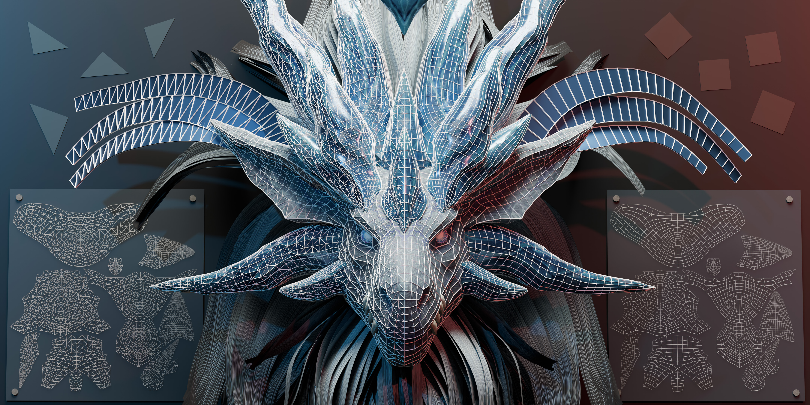

<h1 align="center">Strips as Tokens: Artist Mesh Generation<br>with Native UV Segmentation</h1>

<p align="center"><b>ACM Transactions on Graphics (SIGGRAPH 2026)</b></p>

<p align="center">
  <a href="https://ruixu.me/">Rui Xu</a><sup>1,2*</sup>&nbsp;
  <a href="https://dafei-qin.github.io/">Dafei Qin</a><sup>1,2*</sup>&nbsp;
  <a href="https://dolphinqiao.github.io/">Kaichun Qiao</a><sup>3,2</sup>&nbsp;
  <a href="https://qiujiedong.github.io/">Qiujie Dong</a><sup>4</sup>&nbsp;
  <a href="https://phj128.github.io/">Huaijin Pi</a><sup>1</sup>&nbsp;
  <a href="https://scholar.google.com/citations?user=YvwsqvYAAAAJ&hl=zh-CN">Qixuan Zhang</a><sup>3,2</sup>&nbsp;
  <a href="https://zhanglongwen.com/">Longwen Zhang</a><sup>3,2</sup><br>
  <a href="http://xu-lan.com/">Lan Xu</a><sup>3†</sup>&nbsp;
  <a href="https://www.yu-jingyi.com/">Jingyi Yu</a><sup>3</sup>&nbsp;
  <a href="https://engineering.tamu.edu/cse/profiles/Wang-Wenping.html">Wenping Wang</a><sup>5</sup>&nbsp;
  <a href="https://www.cs.hku.hk/index.php/people/academic-staff/taku">Taku Komura</a><sup>1†</sup>
</p>

<p align="center">
  <sup>1</sup>The University of Hong Kong&nbsp;&nbsp;
  <sup>2</sup>Deemos Technology Co., Ltd.&nbsp;&nbsp;
  <sup>3</sup>ShanghaiTech University&nbsp;&nbsp;
  <sup>4</sup>Shandong University&nbsp;&nbsp;
  <sup>5</sup>Texas A&M University<br>
  <sub>(* Equal contribution. † Corresponding authors.)</sub>
</p>

<p align="center">
  <a href="#">
    
  </a>&nbsp;
  <a href="#">
    
  </a>&nbsp;
</p>

<p align="center">
  
</p>

**Strips as Tokens (SATO)** enables unified, high-quality artist mesh generation with native UV segmentation. Our strip-based tokenizer supports both triangle and quad meshes without retraining and automatically segments UV charts during autoregressive generation.


> 🚀 We are preparing the codebase for public release. Stay tuned!

## 📋 Release Todo List

- [ ] Release tokenizer code
- [ ] Release pretrained checkpoints
- [ ] Release inference code
- [ ] Release data preprocessing code
- [ ] Release training code


---

## Abstract

Recent advancements in autoregressive transformers have demonstrated remarkable potential for generating artist-quality meshes. However, the token ordering strategies employed by existing methods typically fail to meet professional artist standards, where coordinate-based sorting yields inefficiently long sequences, and patch-based heuristics disrupt the continuous edge flow and structural regularity essential for high-quality modeling. To address these limitations, we propose **Strips as Tokens (SATO)**, a novel framework with a token ordering strategy inspired by triangle strips. By constructing the sequence as a connected chain of faces that explicitly encodes UV boundaries, our method naturally preserves the organized edge flow and semantic layout characteristic of artist-created meshes. A key advantage of this formulation is its unified representation, enabling the same token sequence to be decoded into either a triangle or quadrilateral mesh. This flexibility facilitates joint training on both data types: large-scale triangle data provides fundamental structural priors, while high-quality quad data enhances the geometric regularity of the outputs. Extensive experiments demonstrate that SATO consistently outperforms prior methods in terms of geometric quality, structural coherence, and UV segmentation.


## Ack
Our code is based on these wonderful works:
* **[DeepMesh](https://github.com/zhaorw02/DeepMesh)**
* **[MeshMosaic](https://github.com/Xrvitd/MeshMosaic)**
* **[BPT](https://github.com/Tencent-Hunyuan/bpt)**
* **[Hunyuan3D-2.1](https://github.com/Tencent-Hunyuan/Hunyuan3D-2.1/tree/main/hy3dshape)**


## 📚 Citation

If you find this work useful, please cite our paper:

```bibtex
@article{xu2026sato,
  title   = {Strips as Tokens: Artist Mesh Generation with Native UV Segmentation},
  author  = {Xu, Rui and Qin, Dafei and Qiao, Kaichun and Dong, Qiujie and Pi, Huaijin and Zhang, Qixuan and Zhang, Longwen and Xu, Lan and Yu, Jingyi and Wang, Wenping and Komura, Taku},
  journal = {ACM Transactions on Graphics (TOG)},
  year    = {2026}
}
```
